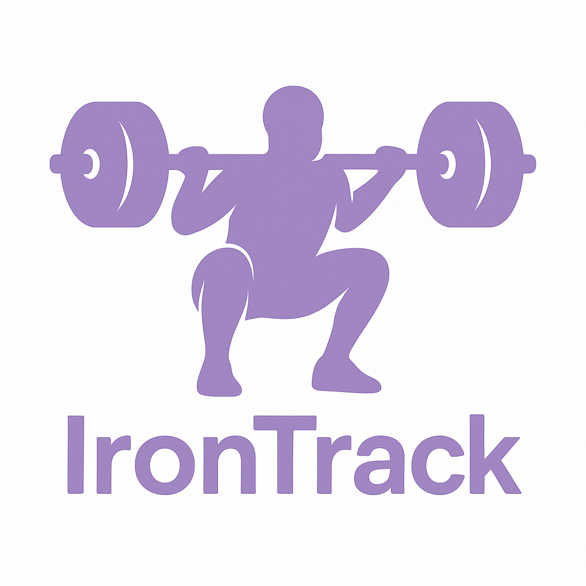

# IronTrack API

<p align="center">
  
</p>

A backend system designed for powerlifting training management (Squat, Bench Press, Deadlift). The application allows athletes and coaches to precisely plan training sessions, track performance progression, and estimate baseline metrics.

## Tech Stack
- **.NET 10** / **C# 14**
- ASP.NET Core Web API
- Swagger / OpenAPI (API Documentation)
- *Planned:* Entity Framework Core, SQL (PostgreSQL/SQL Server), MediatR, xUnit.

## Current Features
* **Exercise Slots Management:** Core CRUD capabilities for scheduling lifts.
* **Strict Domain Validation:** Restricting inputs strictly to official powerlifting disciplines (Squat, Bench Press, Deadlift) and preventing duplicate entries of the same exercise for a single athlete within the same day.
* **Time Restrictions:** Validation layer ensuring training sessions can only be scheduled from 1 day up to a maximum of 14 days in advance.
* **REST API Fundamentals:** Proper HTTP status code handling (200, 201, 204, 400, 404) and foundational separation of concerns (Controller -> Service) powered by Dependency Injection. The project is actively evolving towards its target enterprise architecture.

---

## Architectural Approach (Showcase Project)

**Architecture Evolution**
From a business standpoint, IronTrack API currently handles requirements that could be implemented using a simpler, flat CRUD architecture. However, this project serves as a technical showcase. It is being developed iteratively to adopt Enterprise-grade patterns. Due to the target complexity of the powerlifting domain (e.g., 1RM estimations, DOTS formula calculations, advanced periodization), the application is intentionally designed to evolve towards enterprise-class solutions. In the upcoming stages, the application will adopt **Clean Architecture, CQRS, and Domain-Driven Design (DDD)** to demonstrate proficiency in handling growing business complexity and building scalable software within the .NET ecosystem.

---

## Local Setup

1. Clone the repository:
   ```bash
   git clone https://github.com/pawelkuczek/IronTrack-API.git
